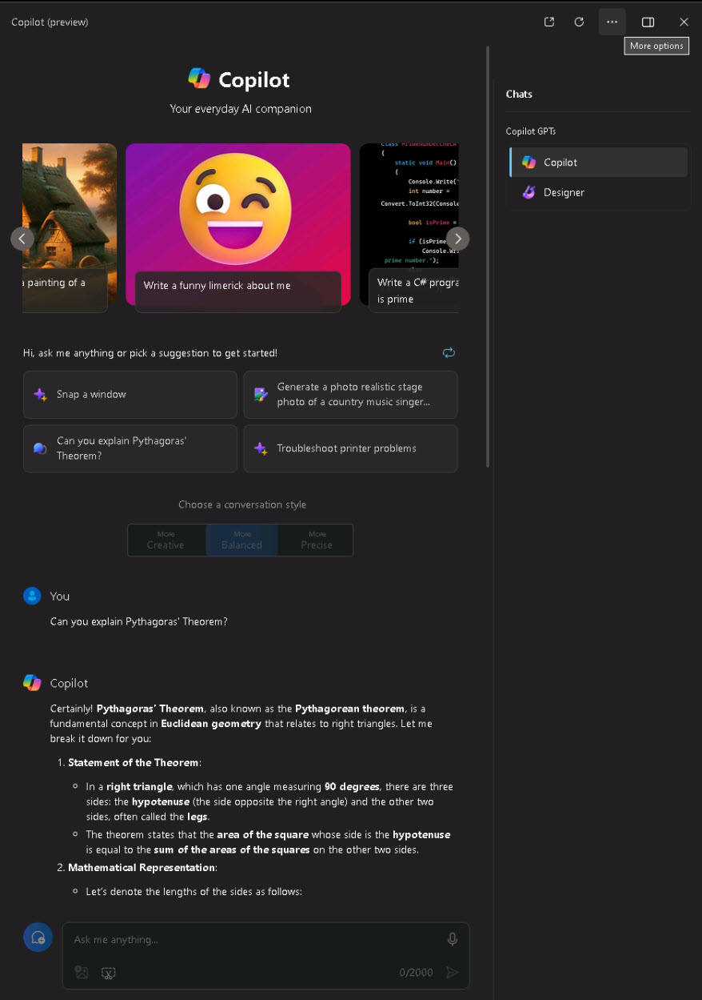

# Task 1.1: Verify apps

1. From the Microsoft 365 apps menu, open **Microsoft Word**.

    {: .note } 
    > In this example you are signed in using an account for a user that does not have a Copilot for Microsoft 365 license assigned.

1. Create a new blank document and confirm Copilot is not integrated is not available in the ribbon bar.

1. Close the **Microsoft Word document** and the **Microsoft Word tab**.

1. From the Microsoft 365 apps menu, select **Copilot in Windows (preview)**.  
    
    

1. Select the **Provide good feedbak** prompt tile and then select **Send** to review the results..

    >**Example Output:**
    

1. Press **Enter** to close the **Copilot (preview)** window. 
