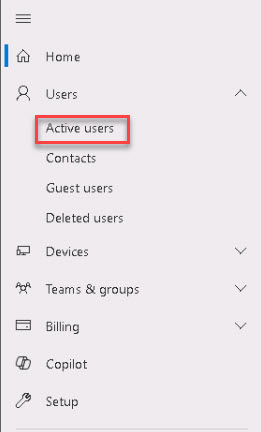
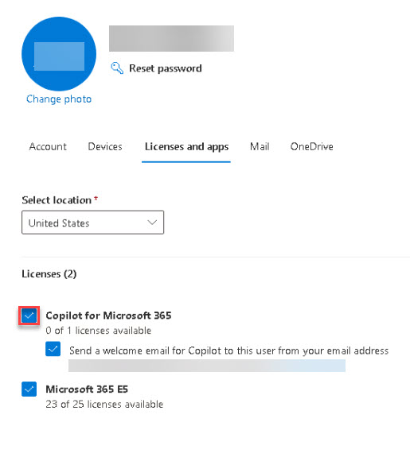
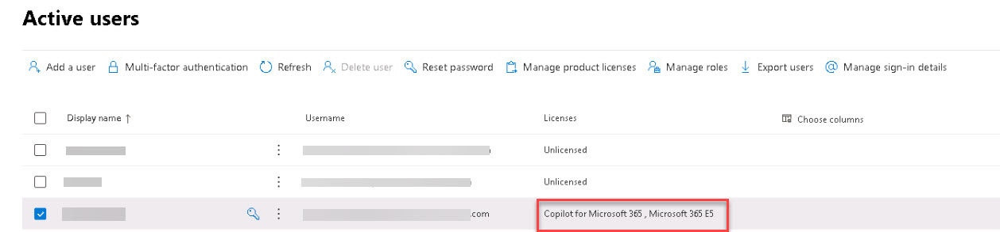

# Task 1.2: Assign a Copilot for Microsoft 365 license

1. On the left navigation menu, select **Users**, then select **Active users**.

            

1. On the **Active users** page, select the **Riley Ramirez** account you'll be using for this lab.

1. On the action menu on top, select **Manage product licenses**.

1. On the **Licenses and apps** tab, under **Licenses**, select **Copilot for Microsoft 365**.

    

1. Select **Save changes**.

1. Close the user details window.

1. On the **Active users** page, under the **Licenses** column, verify that the **Copilot for Microsoft 365** license is listed for the account you're using in this lab.

    

1. Press **Enter** to minimize the browser window.