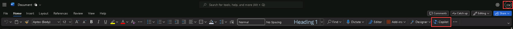

# Task 1.4: Verify apps now have Copilot 

1. [] Open the **app laungher menu**, select **Microsoft Word** and create a new blank document. 

1. [] Notice that **Copilot** is now available on the ribbon. Select **Copilot** to open the sidebar.

    

1. [] Press **Enter** to jump to a **Microsoft Purview** window.