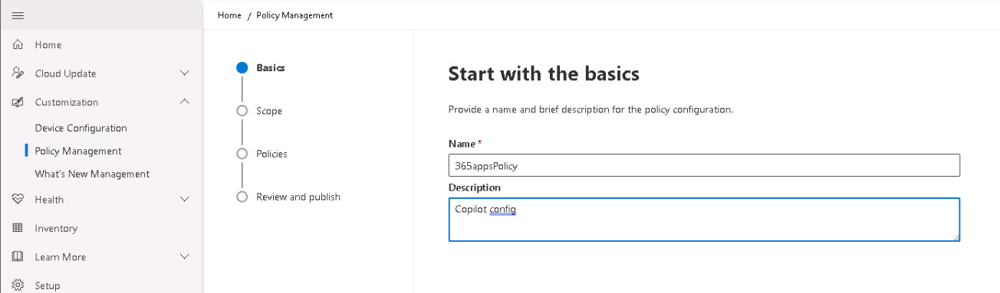
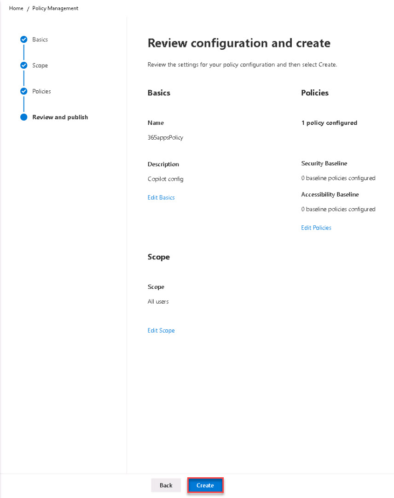

# Task 2.2: Create a Policy configuration 

In this task you'll review the options available to create a policy via the Microsoft 365 Apps admin center. Policies can take 24+ hours to activate. After the policy is created, move on to the next step and come back later to verify the policy. 

{: .warning }
> Policies can take 24+ hours to activate. 

1. In the Microsoft 365 Apps admin center on the left navigation menu, select **Customization** then select **Policy Management**. 

1. Select **Create**.

1. On the **Basics** page, enter the following and select **Next**:

    - Name: **365appsPolicy**
    - Description: **Copilot config**

    

1. On the **Scope** page, select **This policy configuration applies to all users** and then select **Next**.

1. On the **Policies** page, review the available policy settings.

    {: .note } 
	> There are over 2200 policies listed. When you're in the real environment, you can use the search box to locate specific topics.  
    > Here are some interesting policies that can be configured.   
    >
	>	- Turn off Coming Soon
	>	- Disable Document Information Panel
	>	- Disable web templates in File | New and on the Office Start screen
	>	- Disable the Office Start screen for all Office applications
	>	- Block the Office Store
	>	- Use CTRL + Click to follow hyperlinks
    >	- Turn off Draft with Copilot in Outlook

1. In the search box, enter **Copilot** and then press Enter.

1. Review the available Copilot policies, select **Pin Microsoft Copilot to the navigation bar**, and then review the information about it. When complete, close the pane.

1. On the **Review and publish** page, review the settings for your policy configuration and select **Done**.

    {400}

1. Verify that your policy is in the **Policy configurations** list and then press Enter to jump to the Microsoft Intune admin center..

{: .important }
> [Overview of Cloud Policy service for Microsoft 365 - Deploy Office - Microsoft Learn](https://learn.microsoft.com/en-us/deployoffice/admincenter/overview-cloud-policy) 
