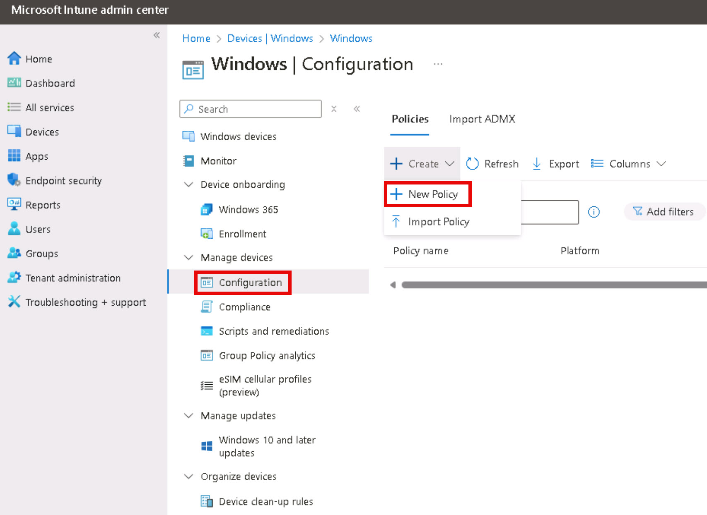
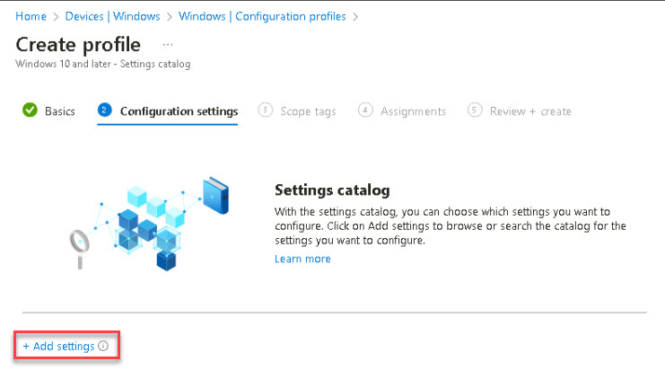
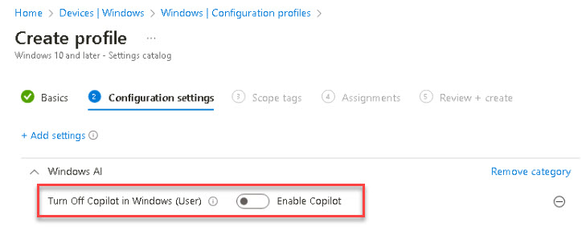
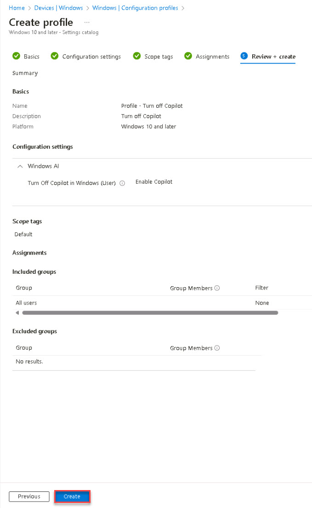

# Task 2.3: Create a configuration profile

1. [] On the left navigation of the Microsoft Intune admin center, select **Devices**.

1. [] On the left pane, under **By platform**, select **Windows**.

1. [] On the left pane, under **Manage devices**, select **Configuration**.

1. [] Under the **Policies** tab, select **+ Create** and then **+ New Policy**.

    {400}

1. [] On the **Create a profile** pane, enter the following:

    | Setting | Value |
    |:---------|:---------|
    | Platform   | **Windows 10 and later**  |
    | Profile type   | **Settings catalog**  |

1. [] Select **Create**.    

1. [] On the Create profile page, on the **Basics** tab, enter **Profile – Turn off Copilot** and then select **Next**.

1. [] On the **Configuration settings** tab, select **+ Add settings**.

    {300}

1. [] On the **Settings picker** pane, type **Copilot** in the searchbox.

1. [] Under **Browse by category**, select **Windows AI**.

1. [] Under **Settings name**, select the **Turn Off Copilot in Windows (User)** checkbox and then close the **Settings picker** window.

1. [] Verify that **Turn Off Copilot in Windows (User)** is disabled.

    {300}

    {: .note }
	> For this lab, the policy was created to demonstrate how a policy can be configured and settings applied when the policy is assigned. We do not want to turn off Copilot in Windows for this lab.

1. [] Select **Next**.

1. [] On the **Scope tags** tab, review the information and then select **Next**.

1. [] On the **Assignments** tab, select **Add all users** and select **Next**.

1. [] On the **Review + create** tab, review the policy and then select **Create**.

    {400}

1. [] Refresh the **Policies** list and verify that the policy is listed.

    {: .warning }
	> Configuration profiles can take 24+ hours to activate. In a real environment, you can come back later to test that the profile is enforced.

1. [] Press Enter to return to the Microsoft 365 admin center Home page.