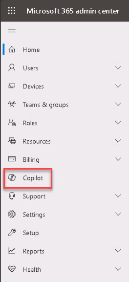
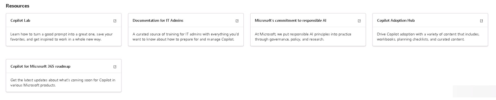
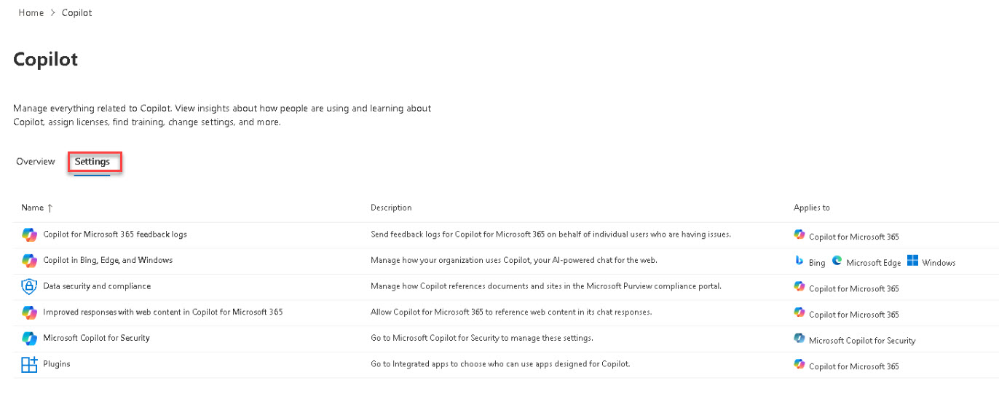

# Task 3.1: Explore settings for Copilot

1. On the left navigation menu, select **Copilot**.

    {200}

1. On the Copilot page **Overview** tab, review the information. 

    

1. On the Copilot page, select the **Settings** tab.

1. Select each setting and review the information in the setting's pane.
	- Select **Copilot diagnostic logs** and then close the pane.
	- Select **Copilot in Bing, Edge, and Windowss** and then close the pane.
	- Select **Copilot in Teams meetings** and then close the tab.
	- Select **Data security and compliance** and then close the pane.
	- Select **Extensions** and then close the pane.
	- Select **Microsoft 365 Copilot self-service purchases** and then close the pane.
	- Select **Optional connected experiences for Microsoft 365 Copilot and Microsoft Copilot** and then close the pane.
	- Select **Pin Microsoft Copilot to the navigation bar** and then close the pane.

    

## **Congratulations!**  

### You've completed Lab 1 - Deploy, manage, and administer Copilot for Microsoft 365 and Windows Copilot.

You helped Contoso to deploy, manage, and administer Copilot for Microsoft 365 and Windows Copilot in their organization. You've laid the foundation for using Copilot to enhance productivity, collaboration, and innovation while reducing costs and complexity through modern IT infrastructure and software, ensuring security and compliance, and attracting top talent by providing efficient tools to streamline work processes. 
