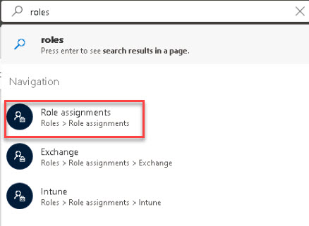
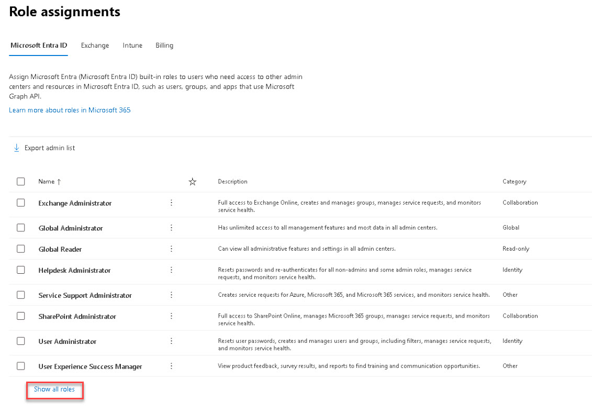

# Task 1.3: Review the default roles available in the Microsoft 365 admin center 

1. In the **Microsoft 365 admin center**, in the search box, search for **roles**.

1. In the search results, under **Navigation**, select **Role assignments**.

    {300}

1. Below the list, select **Show all roles** to list all available roles.

    {500}

1. Review the available roles and their associated descriptions.

1. Near the top of the page, under **Role assignments**, select each tab, the - **Exchange**, **Intune**, and **Billing** tabs - and review the information.

    {: .important }
    > **See the following links for more information:**
    >
    > [About admin roles in the Microsoft 365 admin center](https://docs.microsoft.com/microsoft-365/admin/add-users/about-admin-roles?WT.mc_id=365AdminCSH_inproduct "About admin roles in the Microsoft 365 admin center")
    >
    > [Permissions in Exchange Online](https://docs.microsoft.com/exchange/permissions-exo/permissions-exo?WT.mc_id=365AdminCSH_inproduct   "Permissions in Exchange Online")
    >
    > [Role-based access control - RBAC with Microsoft Intune](https://docs.microsoft.com/mem/intune/fundamentals/role-based-access-control?WT.mc_id=365AdminCSH_inproduct "Role-based access control - RBAC with Microsoft Intune")

1. On the left navigation menu, select **Home**.
