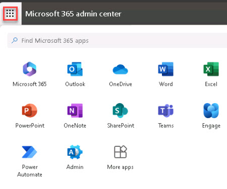
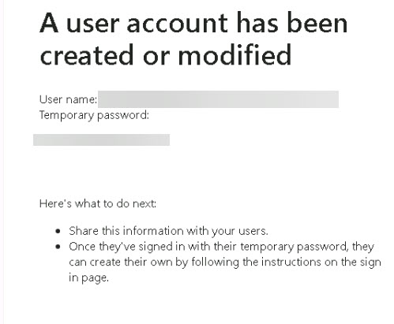

# Task 2.1: Access Outlook

1. In the Microsoft 365 admin center, in the upper left of the page, select **App launcher**.

    

1. Select **Outlook**.

1. In the **Inbox**, locate the **Microsoft on behalf of your organization** email and select it. Notice that it contains the user credentials for the user you created in the previous exercise.

1. This is where you would find the **User name** and **Temporary password** for the new user created.

    

1. Press Enter to proceed.
