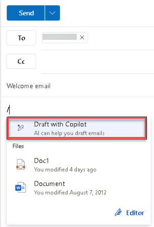

# Task 2.2: Compose a welcome email using Copilot

1. In the upper-left, select **New mail**.  
 
1. Enter the email of the user you just created: **Jane Doe**.

1. In the **Subject** box, enter **Welcome email**.

1. Select **Draft with Copilot**.

    {: .important }
	> Alternatively, select inside of the message body of the email and enter **/** and select **Draft with Copilot**.
    >
    > 

1. Using Copilot, generate a prompt that achieves the following, you can copy and paste the text inthe field, and then select **Generate*:

    ```
	Welcome the user to the company
	
	Acknowledge that Copilot for Microsoft 365 has been deployed for Contoso
	
	Introduce them to copilot and its features
	```

1. Select **Keep it** and then select **Send**.

1. Press Enter to proceed.