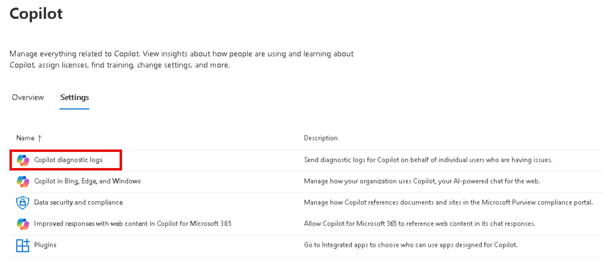

# Task 3.2: Send diagnostic logs for Copilot for Microsoft 365 on behalf of individual users who are having issues

1. [] In the Microsoft 365 admin center, on the left navigation, select **Copilot**.


1. [] Here you can review the information on the **Overview** page.  
    - Assess the active users and the apps those users are leveraging Copilot for Microsoft 365.
    - Review the assigned licenses and message center information.

1. [] Select the **Settings** tab.

1. [] Review the settings names and descriptions.

1. [] Select **Copilot diagnostic logs**.

    

1. [] On the **Copilot for Microsoft 365 diagnostic logs** pane, review the information and then select **Start**.

1. [] On the **Collect data** pane, review the information and enter this user's email into the **Search for and select the user you want to submit Copilot feedback logs for** box.

	```
	nestorWilke@skillableproserv.onmicrosoft.com
	```

1. [] Select the user's email in the dropdown.

1. [] Under **Select the product Copilot is in**, select **Microsoft 365 (Office)**.

1. [] Select **Next**.

1. [] On the **Review and send Copilot feedback to Microsoft** pane, Select the **Something else(tell us more below)** and then enter this comment:
	
    ```
	Include details about why you're sending the file here.
	```
	
1. [] Then select **Cancel** > **Yes**.
    
    {: .note }
	> For the purpose of this lab, diagnostic feedback to Microsoft does not need to be submitted.

1. [] In te left navigation menu, select **Home** to return to the Microsoft 365 admin center landing page.