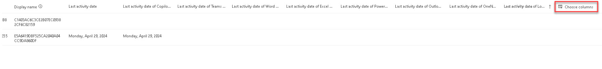

# Task 4.1: Review the Copilot for Microsoft 365 usage report

1. In the Microsoft 365 admin center, on the left navigation menu, select the ellipses: **Show all**, then select **Reports**, and then **Usage**.

1. On the left navigation menu, under **Reports**, select **Copilot for Microsoft 365**.

1. Review the **Readiness** page.

1. Select **Usage**.

1. Select the **Filters** menu and notice the availability of the report retention.

    {: .note }
	> Microsoft 365 usage reports show how people in your business are using Microsoft 365 services. Reports are available for the last 7 days, 30 days, 90 days, and 180 days. Data won't exist for all reporting periods right away. The reports become available within 48 hours.
	

1. Under **Adoption**, select the **Summary** view.

1. Select the **Trend** view, and select the chart for details.

1. Under **Copilot usage details**, review the table.

    {: .important }
	> Notice that some of the information is concealed for privacy.

1. Select **Choose columns**, and the select the last column header on the table.  

    {: .warning }
	> You may need to scroll completely to the right to see the last column.

    

1. Review the available columns and, when complete, close the pane.

---

## **Congratulations!**  

### You've completed Lab 2 – Configure users in Microsoft 365 admin center.

You helped address Contoso's need to increase its innovation and agility using AI by configuring employee roles in the Microsoft 365 admin center and assigning Copilot licenses. By enabling employee feedback on Copilot responses to their prompts and reviewing usage reports in the Microsoft 365 admin center you've also helped improve employee quality of life, supporting Contoso's goal of employee retention.
