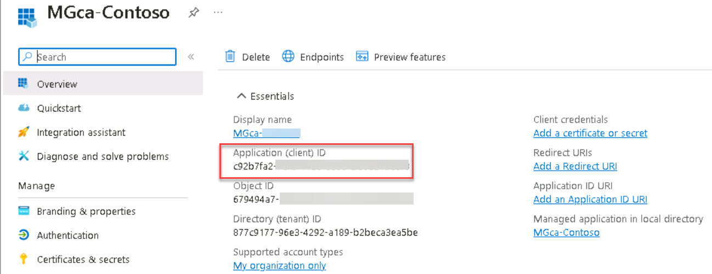
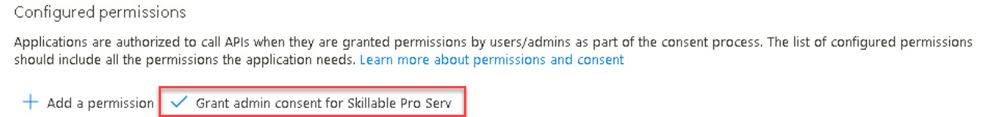
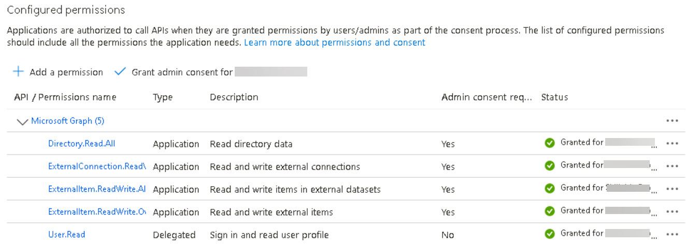

# Task 1.2: Create an app for the Microsoft Graph connector agent

The new app registration provides a mechanism for the agent to securely connect to Microsoft 365.


1. In the Microsoft 365 admin center left navigation menu, select the **Identity** admin center.  
    If necessary, select **Show all**.

1. In the **Identity** admin center, on the left menu, select **Applications**, then select **App registrations**.

1. On the **App registrations** page, on the menu, select **+ New registration**.

1. On the **Register an application** page, in the **Name** box, enter:

    ```
    MGca-Contoso
    ```

1. Review the remaining settings and then select **Register**.

1. Copy the **Application (client) ID** so it will be saved and used later in the lab.

    

1. In the new pane menu, under **Manage**, select **API permissions**.

1. In the **Configured permissions** list, select **Microsoft Graph (1)**.

1. On the **Request API permissions** pane, select **Application permissions**.

1. Under **Select permissions**, in the search box, enter **ExternalItem.ReadWrite.OwnedBy**.

1. In the results, select the **ExternalItem.ReadWrite.OwnedBy** checkbox.

1. Search for and then select the checkboxes for the following permissions:

    - **ExternalItem.ReadWrite.All**
    - **ExternalConnection.ReadWrite.OwnedBy**
    - **Directory.Read.All**

1. Select **Update permissions**.

1. Verify the new permissions have been added.

1. Under **Configured permissions**, select **Grant admin consent for Skillable Pro Serv**.

    

1. In the **Grant admin consent confirmation** dialog, review the information and then select **Yes**.

    

1. Verify the **Status** of all permissions are now listed as **Granted**.

    
