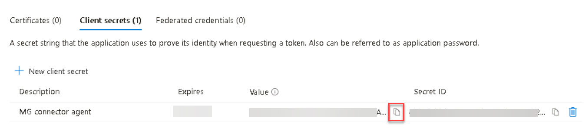

# Task 1.3: Configure client secret authentication for the app

The Microsoft Graph connector agent can use client secret or certificate-based authentication. For this lab, client secret authentication will be used.

1. In the new app, on the left menu under **Manage**, select **Certificates & secrets**.

1. On the **Client secrets** tab, select **+ New client secret**.

1. On the **Add a client secret** pane, in the **Description** box, enter **MG connector agent** and then select **Add**.

1. Copy the **Value** of the client secret to a text file and save it so you can use it later in the lab.

    

    {: .warning }
    > When in the real environment it's important to copy the generated secret value and save it because it's not shown again. 

1. Press Enter to proceed.
