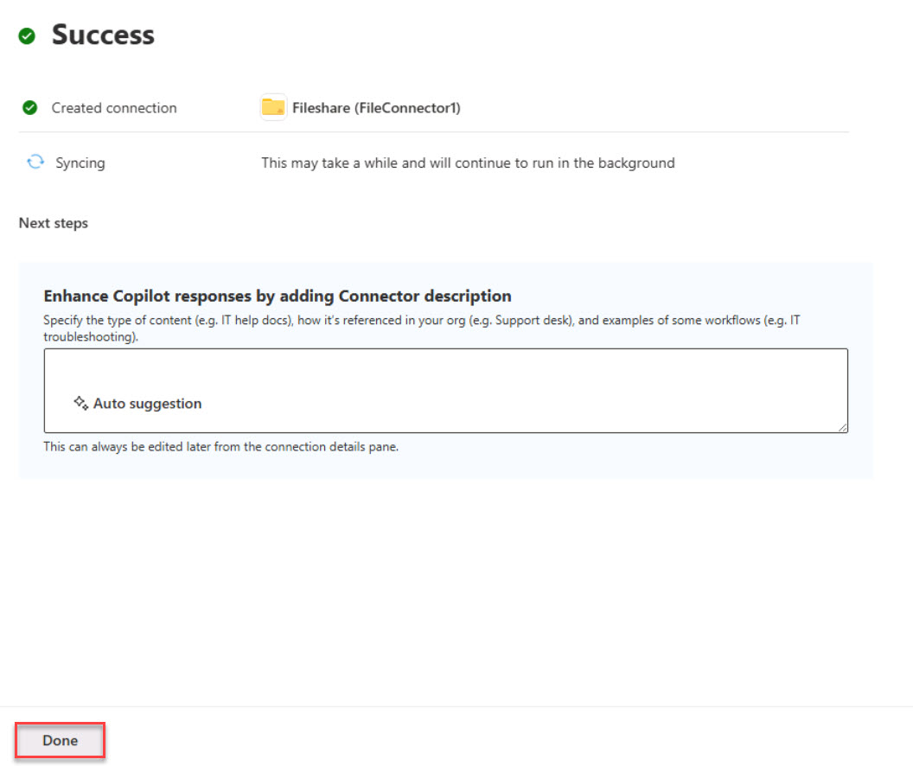

# Task 1.5: Add and configure the file share connection

For this task, you'll use a file share local connection to the Microsoft Graph connector agent to demonstrate the ability of Copilot for Microsoft 365 to use on-premises content.

{: .warning }
> In a real-life environment, you would need to connect to a data source from your connection. For the purpose of this lab, you have a folder **Fileshare** on the local machine being used. You'll see its address being referenced:
**\\DESKTOP-B600HS0\\Users\\Admin\\Documents\\FileShare**.
> 
> This folder contains **34** files.

1. Open the **Edge** browser.

1. In the left navigation menu, expand **Settings** and then select **Search & intelligence**.

1. On the **Search & intelligence** page, select the **Data sources** tab.

1. On the **Data sources** tab, select **+ Add Connection**.

1. On the **Connect to data source** page, review the available data sources that you can use.  
    Select **File share** and then select **Next**.

1. In the below fields, fill in these values:

    | Field | Value | 
    |:---------|:---------|
    | Display name | **FileConnector1** | 
    | Data sources  | \\\DESKTOP-B600HS0\Users\Admin\Documents\FileShare | 
    | Authentication type |  **Windows**  | 
    | Username |  **Admin**  | 
    | Password |  **Passw0rd!**  | 

1. Review the info and select the checkbox to accept the terms.

1. Select **Create**.

1. Select **Done**.

    

1. On the **Data sources** tab, review the newly created connection.  
    Notice the **Connection state** column. 
    In a real world environment, the status will update to **Ready** after publishing is complete. This may take 5-10 minutes.

   
{: .important }
> Select the following link to learn more about [**Set up Microsoft Graph connectors in the Microsoft 365 admin center**](https://learn.microsoft.com/microsoftsearch/configure-connector).
