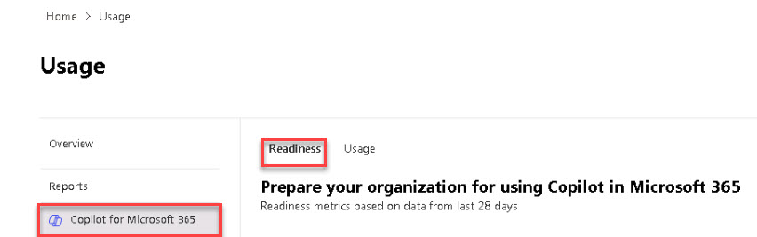

# Task 1.1: Access the Copilot for Microsoft 365 Readiness dashboard

1. In the **Microsoft 365 admin center** left navigation menu, select **Show all**, then **Reports**.

1. Select the **Usage** option.

1. In the **Reports** menu pane, select **Copilot for Microsoft 365**.

1. Review the information on the **Readiness** tab.

    