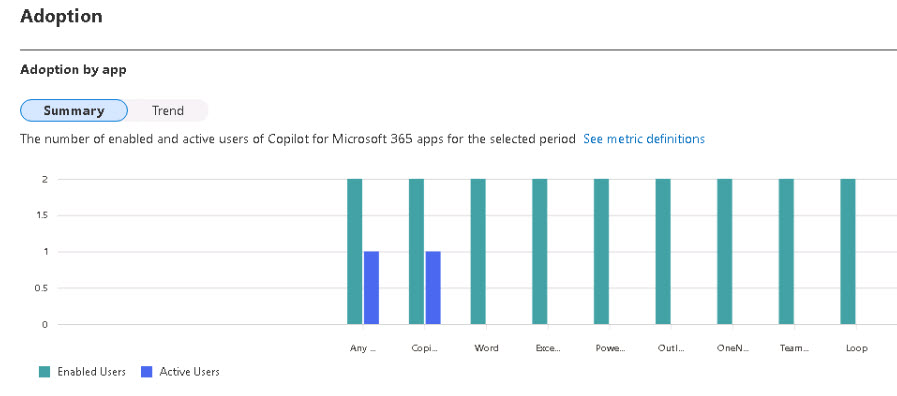
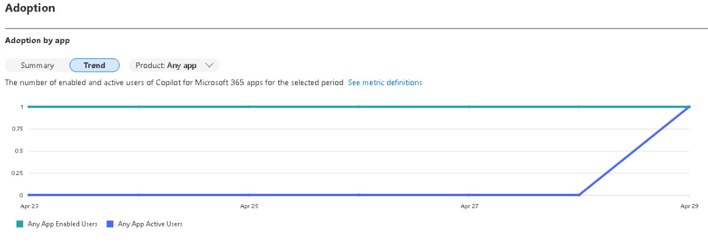

# Task 1.2: Access and filter the Copilot for Microsoft 365 usage report

1. Select the  **Usage** tab and in the **Copilot for Microsoft 365 usage** report, use the dropdown menu next to **Filters:** to select **7 days** period.

1. Under the **Adoption** section, hover over the bars to examine the breakdown of Copilot for Microsoft 365 usage by product. 

    {: .important }
    > You can review the number of enabled users, active users, and active users rate for each product.
    
    {500}

1. Select the **Trend** view and use the dropdown menu to select **Teams**. 

    {: .important }
    > You can examine the daily trend of Copilot for Microsoft 365 usage for the selected product over the time period.

    {500}

1. Review the information there and then press Enter to proceed.