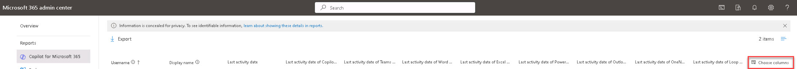

# Task 1.3: Export the report data into an Excel file

1. Scroll down to the **Copilot usage details** section and near the end of the table column headers, select **Choose columns** to add or remove columns from the table. You can customize the table to show only the columns that are relevant to you.  
    This section shows the list of users who have Copilot for Microsoft 365 licenses and their last activity date for each product. You can sort, filter, and search the table by any column.
	
1. Close the **Chose columns** pane.

    

1. Select **Export** to download the table.

1. Open the downloaded **.csv** file in Microsoft Excel. In a real environment you can use the built-in features of Excel to further analyze, visualize, and share the report data.  
    For example, you can create pivot tables, charts, or dashboards to highlight the key insights from the report data.

---

## **Congratulations!**  

### You've completed Lab 4 - Explore Reporting Options for Copilot.

You used Copilot for Microsoft 365 reports to provide insight into Contoso's Copilot rollout, demonstrating the value of adopting Copilot and the productivity increases it provides.
