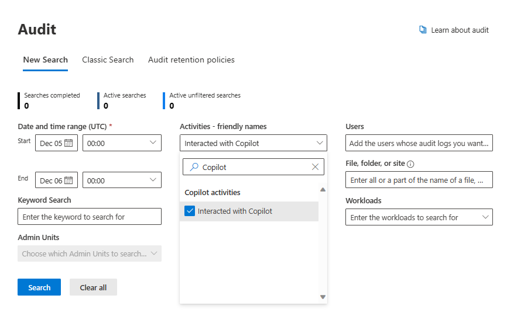

# Task 1.1: Search the audit log for Copilot interactions in Microsoft Purview

When auditing Copilot interactions, Microsoft Purview Audit captures detailed events including user interactions with Copilot, the Microsoft 365 service where the activity occurred, and references to any accessed files stored in Microsoft 365. If these files have sensitivity labels, this information is also recorded. To search for these interactions with your M365 license, follow these steps:

1. Select **Audit**.

1. Configure your search on the **Search** tab. Set the **Start date** - **October 23rd**

1. Select the **End date** for your search as **October 24th**.

1. In the **Activities - friendly names** field type **copilot** and then from the dropdown, select the **Interacted with Copilot** checkbox.

    {600}

1. In the **Record Types** type **Copilot** and from the dropdown list select the **CopilotInteraction** checkbox.

1. In the **Search name** box, enter **Copilot Interaction** and then select **Search**.

1. Select **Search** to start your search job.

    {: .highlight }
	> A maximum of 10 search jobs can be run in parallel for one user account. If a user requires more than 10 search jobs, they must wait for an *In progress* job to finish or delete a search job.  

1. Review your search results, you have one hit. Press Enter to proceed.

{: .important }
> ### Limitations and considerations for auditing Copilot interactions
>
When implementing compliance management solutions for Copilot in Microsoft 365, it's important to be aware of the limitations and considerations:
>
- **Scope of auditing**: Auditing captures the occurrence of Copilot activities, such as search events, but doesn't record the actual user prompts or responses. For detailed interaction data, eDiscovery tools should be used.
>
- **Admin-related changes exclusion**: Changes related to Copilot administration, such as configuration adjustments, aren't currently captured in the auditing logs.
>
- **Device Identity Information**: Device identity information, which can be important for comprehensive auditing, isn't included in the audit details for Copilot activities.
>
**Application-specific limitations:**
>
- **Copilot in Teams**: When transcripts are turned off, auditing capabilities for Copilot interactions aren't supported. Actions involving referencing transcripts aren't captured in the audit logs.
>
- **Identification of Source App**: The source of Copilot interactions is identified by the app name in the audit logs, such as Copilot in Word or Copilot in Teams.
>
> #### Learn more:
>
> [Microsoft Purview data security and compliance protections for Microsoft Copilot](https://learn.microsoft.com/purview/ai-microsoft-purview "Microsoft Purview data security and compliance protections for Microsoft Copilot")
>
> [Considerations for deploying Microsoft Purview data security and compliance protections for Copilot](https://learn.microsoft.com/purview/ai-microsoft-purview-considerations "Considerations for deploying Microsoft Purview data security and compliance protections for Copilot")
>
> [Auditing solutions in Microsoft Purview](https://learn.microsoft.com/purview/audit-solutions-overview "Auditing solutions in Microsoft Purview")
>
> [Audit log activities](https://learn.microsoft.com/purview/audit-solutions-overview "Audit log activities")