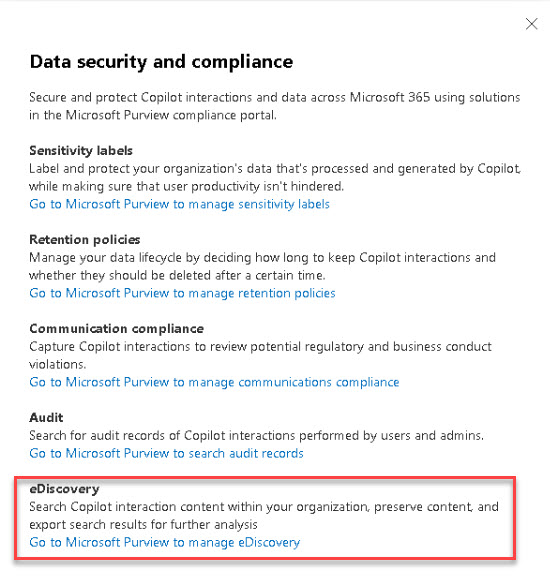

# Task 4.1: Manage eDiscovery (Standard) or (Premium) in Microsoft Purview

Electronic discovery, or eDiscovery, is the process of identifying and delivering electronic information that can be used as evidence in legal cases.  

You can use eDiscovery tools in Microsoft Purview to search for content in Exchange Online, OneDrive for Business, SharePoint Online, Microsoft Teams, Microsoft 365 Groups, and Viva Engage teams. 

You can search mailboxes and sites in the same eDiscovery search, and then export the search results. You can use Microsoft Purview eDiscovery (Standard) cases to identify, hold, and export content found in mailboxes and sites.  
 
If your organization has an Office 365 E5 or Microsoft 365 E5 subscription (or related E5 add-on subscriptions), you can further manage custodians and analyze content by using the feature-rich Microsoft Purview eDiscovery (Premium) solution in Microsoft 365. 

 

*Microsoft Purview provides three eDiscovery solutions: Content search, eDiscovery (Standard), and eDiscovery (Premium).* 

| Content Search | eDiscovery (Standard) | eDiscovery (Premium)    | 
|:---------|:---------|:---------| 
|  Search for content   | Search and export   | Custodian management    | 
| Keyword queries and search conditions   | Case management   | Legal hold notifications | 
| Export search results     | Legal hold          | Advanced indexing    | 
| Role-based permissions    |                       | Review set filtering | 
|                           |                       | Tagging      | 
|                           |                       | Analytics                | 
|                           |                       | Predictive coding models | 
|                           |                       | And more...  | 

 

{: .highlight }
>  Review [Microsoft Purview eDiscovery solutions](https://learn.microsoft.com/en-us/purview/ediscovery "Microsoft Purview eDiscovery solutions") for more information and to review prerequisites. 

1. In to the **Microsoft 365 admin center**, on the left menu, select **Copilot**.

1. Select the **Settings** tab and then select **Data security and compliance**.

1. Under **eDiscovery**, select **Go to Microsoft Purview to manage eDiscovery**.

    

1. In Microsoft Purview, review the **Overview** page and then select the **Cases** tab.

1. Select **+ Create a case**. 

    {: .note }
    > The user who creates the case is automatically added as a member. Members of the case can access the case in the Microsoft Purview compliance portal and perform eDiscovery (Premium) tasks.

1. Enter a name, description, and number.

    | Field | Value | 
    |:---------|:---------|
    | Name | **Case01** | 
    | Description | **Sample Description**  |
	| Number | **1234**  |
	
    

1. Select **Next**.

1. In the **Members and settings** page, under **Users**, add **Nestor Wilke** as a user from your organization and then select him from the dropdown.

    {: .warning }
    > Users and groups that should be assigned to the case must be assigned the appropriate [eDiscovery permissions](https://learn.microsoft.com/purview/ediscovery-assign-permissions).
 
1. Select **Next**. 

1. Review the configuration for the case and then select **Submit**.

1. Select **Done**.

1. In the new case, review the **Overview** information.

1. Select the **Collections** tab and then select **New collection**.

    {: .new }
    > The creation of a eDiscovery case is only the beginning. To learn more about collections and other related eDiscovery settings, go to [Overview of collections in eDiscovery (Premium)](https://learn.microsoft.com/purview/ediscovery-collections).  
    > And [Microsoft Purview eDiscovery solutions](https://learn.microsoft.com/purview/ediscovery).

1. On your own, complete the creation of the collection using the Microsoft Learn article to help you with the different options that can be configured.

{: .important }
> eDiscovery is a powerful tool available to organizations using Microsoft 365. The intent of this task is to help you identify where this Microsoft Purview feature is and perform some basic configurations. To learn more, go to [Microsoft Purview eDiscovery solutions](https://learn.microsoft.com/purview/ediscovery).

---

## **Congratulations!**  

### You've completed Lab 5 - Manage compliance with Microsoft Purview for Copilot for Microsoft 365.

You helped Contoso manage and govern it's data assets with Microsoft Purview, as well as ensure Copilot security compliance, fulfilling their requirement for high security and compliance standards for data protection and privacy.
