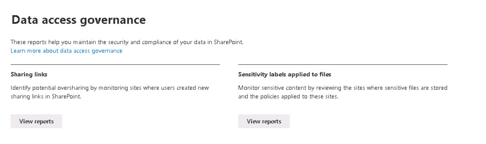

# Task 1.1: Access SharePoint Data Access Governance DAG

1. [] In the Microsoft 365 admin center, on the left menu, under **Admin centers**, select **SharePoint**. You might need to select **Show all** first.

1. [] In the **SharePoint admin center**, on the left menu, select **Reports** > **Data access governance** to access the DAG reports.  

    {: .note }
    > The following reports are currently available: 
    >- **Sharing links**
    >
    >- **Sensitivity labels applied files**
    >
    
    

