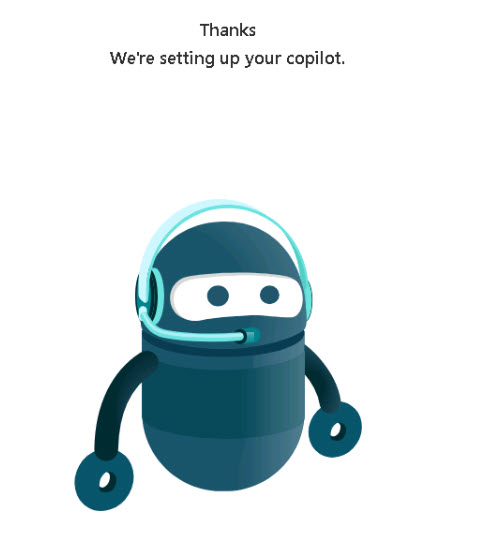

# Task 1.2: Go to Copilot Studio and create a custom copilot

 

1. [] On the **Copilot Studio** home page, on the left menu, select **Copilots**.
 

1. [] Select **+ New copilot**. 

 
1. [] In the upper-right, select **Skip to configure**.

1. [] In the **Name** box, enter **Technology Specialists** and select **Save** on the preferred language popup message.
 

1. [] Review the **Give your copilot some knowledge by setting up your Generative AI** section to learn about adding information from your website but do not enter a website at this time. 

1. [] Select **Add knowledge**, to review knowledge sources, and then close the **Add available knowledge sources** popup window.

1. [] Select **Create**

	 

1. [] Press Enter to proceed.