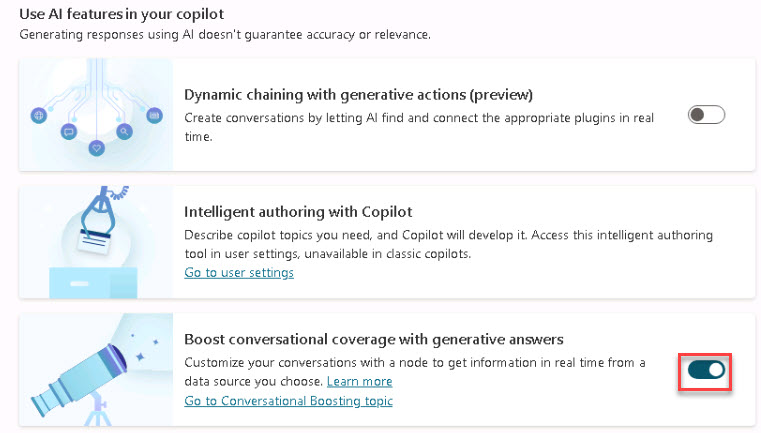

# Task 1.3: Download and upload artifacts  

 
1. [] In **Copilot Studio**, on the copilots list, select **Technology Specialists**.

 
1. [] Select the **Knowledge** tab and then select **+ Add knowledge**.

1. [] In the **Add available knowledge sources** dialog box, select **Files**.

1. [] On the Upload files page, Select **click to browse**.

1. [] Select **Add**.
  

     
	
	
1. [] Review the data that was added and then press Enter to proceed.