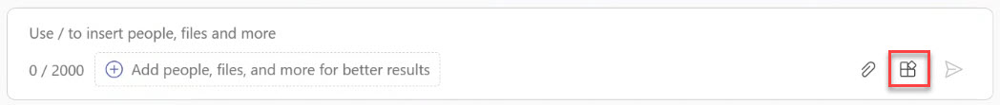
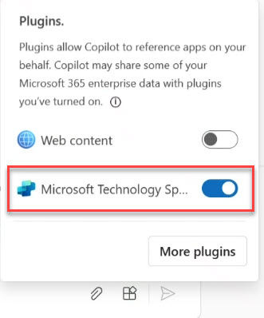

# Task 2.1: Enable the Conversational Plugin in Teams

1. In **Teams**, on the left menu, select **Copilot**. 

1. In the lower right area of the Copilot prompt, select the **Plugins** icon. 

     

1. Expand **Copilot Studio** and then verify that the **Microsoft Technology Specialists** conversational plugin is listed and enabled.

     

1. Press Enter to continue.