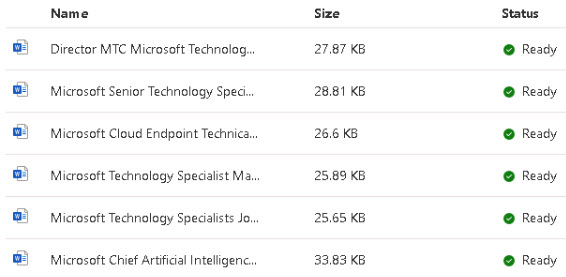
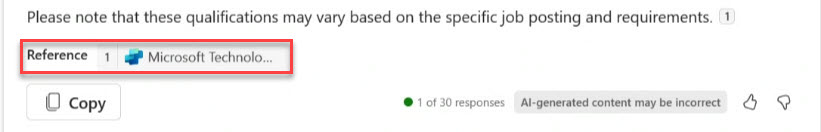

# Task 2.3: Test the conversational plugin with some prompts

 
1. In **Copilot Studio**, on the **Technology Specialists** page, select the **Knowledge** tab and make sure the documents are ready.

     


1. Return to the **Teams** tab. 

 
1. Enter the following: 

    ```
	What are the qualifications for a Microsoft Technology Specialist?
	```

1. Select the **Send** button.
	
    {: .note }
    > Notice the response, and the expanded section below showing the table with developer information.
    > You should see the Matched Functions call out the plugin, and the Function Execution Details show a status of Success.  


1. Enter the following: 

    ```
	What are the qualifications for a Microsoft Technology Manager role?
	```

1. Select the **Send** button.

    {: .note }
	> Notice that in the response, it should show the Copilot Studio small icon with the name of the Copilot Studio Plugin, along with the job posting documents it referenced that we uploaded into the Dataverse for this plugin. 
    >  

1. Enter the following: 

    ```
	Are there any top secret Microsoft Technology opportunities?
	```

1. Select the **Send** button.


1. Enter **-developer off** to turn off developer mode and select **Send**.

---

## **Congratulations!**  

### You've completed Lab 7 - Extend Copilot for Microsoft 365 using Microsoft Copilot Studio

You've completed all labs succesfully!